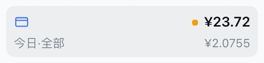
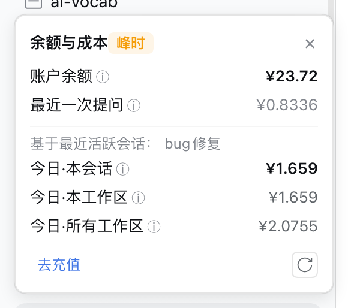

# dsh-balance-widget

[中文](README.md) | **English**

[](https://www.npmjs.com/package/dsh-balance-widget)
[](https://github.com/LL-cmyk-so/dsh-balance-widget)
[](https://github.com/LL-cmyk-so/dsh-balance-widget/blob/main/LICENSE)
[](https://github.com/LL-cmyk-so/dsh-balance-widget)
[](https://nodejs.org)
[]()

A balance & cost widget for the [DeepSeek Harness](https://github.com/deepseek-ai/deepseek-harness) (DSH) Web GUI: a 💰 icon in the corner of the conversation session header. Click it to see your DeepSeek account balance and the current session's estimated spend.

## Preview

| Balance always visible | Popover on click |
| --- | --- |
|  |  |

## How it differs from similar plugins

| Aspect | This plugin | Others (dsh-balance / dsh-token-price / ...) |
| --- | --- | --- |
| **Zero external dependencies** | ✅ Imports no `@deepseek-ai/*` packages, no native modules | ❌ Most depend on dsh SDK packages |
| **Node 24 ready** | ✅ Works out of the box on any profile layout | ⚠️ Many community plugins still error on Node 24 |
| **Boot stability** | ✅ Registers routes via official `ctx.webServer`; never conflicts with apiproxy | ⚠️ Some self-host HTTP servers that crash `dsh web` on boot |
| **On-demand queries** | ✅ Fetches balance only on click; no polling, zero background requests | Some always-on badges refresh on a timer |
| **Peak/off-peak pricing** | ✅ Built-in official 2026-08-17 rate table, auto-switches by window | Partial support |
| **Security** | ✅ API key stays in the host process; loopback-only guard | Varies |

**In one line**: *The zero-dependency, Node 24-ready balance/cost widget that never breaks `dsh web` boot.*

## Features

- **Account balance** — On click, the host proxies DeepSeek's official `GET /user/balance` and shows the `¥` balance. The API key is resolved through the host credentials service and never leaves the host process; the browser only talks to same-origin routes.
- **Session cost (estimate)** — Computed from the session's `tokenUsage` projection × DeepSeek's official peak/off-peak price table. Follows the configured model (default `deepseek-v4-flash`, switchable to `deepseek-v4-pro`) and the Beijing-time peak/off-peak windows automatically.
- **Last prompt cost (estimate)** — Parses the current session file and prices the last turn's token usage, answering "how much did that last prompt cost".
- **Today total cost (estimate)** — Walks every session under `~/.dsh/sessions/` and sums today's (calendar day) token usage × price.
- **Token usage** — Also shows the session's input (incl. cache hits) / output tokens.
- **One-click top-up** — a "Top up" link in the popover footer jumps to the official DeepSeek top-up page (platform.deepseek.com/top_up) in a new tab.
- **Sidebar card** — a persistent card at the sidebar footer shows balance, a remaining-ratio bar, and today's total; globally visible, refreshes every 60s.
- **Remaining-ratio bar** — blue (healthy) → amber (below lowThreshold) → red (below criticalThreshold).
- **Official price auto-sync** — fetches the DeepSeek official pricing page on startup and every 12h; falls back to built-in rates on failure.
- **Agent tool** — a `deepseek_billing` tool lets the model answer "how much balance do I have / how much did today cost".
- **On-demand refresh** — No polling, no background requests; endpoints are only hit when you click the icon. Costs zero tokens to use.

## Why this plugin

- **Zero external dependencies** — the host half imports no `@deepseek-ai/*` packages and no native modules, so it loads from any profile layout and works on **Node 24** (many community cordis plugins still lag on Node 24).
- **Uses official APIs only** — routes are registered through `ctx.webServer` (the same seam `dsh-ssh` uses) with loopback-only guards; no conflicting custom HTTP servers.

## Architecture

```
host half (lib/index.js)
  ctx.webServer.register:
    GET /api/dsh-balance/balance    → official /user/balance (loopback-only guard)
    GET /api/dsh-balance/last-cost  → last prompt cost (session file + zstd decode)
    GET /api/dsh-balance/today-cost → today's total across all sessions

client half (lib/client.js)
  ctx.slots.inject("conversation.session.header.utilities")
    → 💰 icon (session header, top-right corner)
    → click fetches same-origin APIs → popover with balance + three costs + tokens
```

## Installation

From npm (once published):

```sh
dsh plugin --profile web add dsh-balance-widget
```

From GitHub (development):

```sh
git clone https://github.com/LL-cmyk-so/dsh-balance-widget.git
cd dsh-balance-widget
dsh plugin --profile web add "link:$(pwd)"
```

Then restart `dsh web`.

## Configuration

### Where the config file lives

DSH plugin configuration lives in:

```
~/.dsh/profiles/web/cordis.patch.yml
```

### All options

Append to `cordis.patch.yml` (only change the lines you need; the rest stay at defaults):

```yaml
- id: balance-widget
  name: dsh-balance-widget
  config:
    balanceBaseURL: https://api.deepseek.com   # official balance endpoint (rarely changed)
    balanceApiKeyEnv: DEEPSEEK_API_KEY          # credential ref for the API key (rarely changed)
    requestTimeoutMs: 5000                      # balance request timeout (ms)
    modelId: deepseek-v4-flash                  # pricing model (or deepseek-v4-pro)
    lowThreshold: 5                             # balance below this (¥) turns the icon amber
    criticalThreshold: 1                        # balance below this (¥) turns the icon red
```

### Example: custom balance thresholds

By default the icon turns **amber below ¥5 and red below ¥1**. To warn at ¥10 / ¥3 instead:

```yaml
- id: balance-widget
  name: dsh-balance-widget
  config:
    lowThreshold: 10
    criticalThreshold: 3
```

Restart `dsh web` for changes to take effect.

### Example: price with V4-Pro

If you mainly use DeepSeek-V4-Pro, point the pricing model at it for a more accurate estimate:

```yaml
- id: balance-widget
  name: dsh-balance-widget
  config:
    modelId: deepseek-v4-pro
```

**Note**: `cordis.patch.yml` may already contain lines for other plugins — append new lines without touching existing ones.

## Pricing

Built-in DeepSeek official peak/off-peak pricing (CNY per 1M tokens), effective 2026-08-17. Peak windows are Beijing time 09:00–12:00 and 14:00–18:00; prices are double the off-peak rates:

| Model | Window | Cache hit (input) | Cache miss (input) | Output |
| --- | --- | --- | --- | --- |
| V4-Flash | Off-peak | 0.05 | 1.5 | 4.5 |
| V4-Flash | Peak | 0.10 | 3.0 | 9.0 |
| V4-Pro | Off-peak | 0.15 | 4.5 | 13.5 |
| V4-Pro | Peak | 0.30 | 9.0 | 27.0 |

`deepseek-chat` / `deepseek-reasoner` aliases map to Flash / Pro pricing respectively. Costs are **estimates**; actual billing from the provider is authoritative.

## Changelog

### v0.2.0 — Last prompt & today total cost
- ✨ **Added**: popover now shows "last prompt cost" and "today total cost"
  - Last prompt: prices the current session's last turn from the session file
  - Today total: walks every session under `~/.dsh/sessions/` and sums today's usage
- 🐛 **Fixed**: session-id prefix duplication in the last-cost route (both `session-`-prefixed and bare ids resolve)

### v0.1.0 — Initial release
- 🎉 Account balance (official `/user/balance`) + session cost (estimate) + token usage
- On-demand refresh: no polling, queries only on click, costs zero tokens

## Verify

- Config tree: `dsh --profile web --dump-config` should show a `balance-widget` entry.
- Balance route: after restarting dsh web, `curl -s http://127.0.0.1:3080/api/dsh-balance/balance` should return `{ ok, balance_infos, modelId }`.
- Cost routes: `curl -s "http://127.0.0.1:3080/api/dsh-balance/last-cost?session=<sessionId>"` and `curl -s http://127.0.0.1:3080/api/dsh-balance/today-cost` should return `{ cost, inputTokens, outputTokens, modelId }`.

## License

MIT
